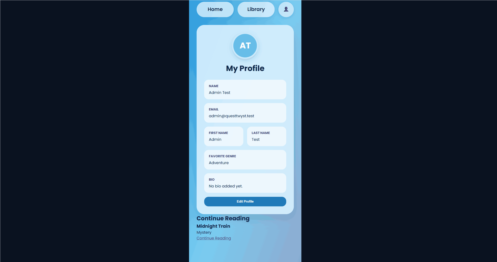

# QuestTwyst  

CodePath WEB103 Final Project

Designed and developed by: Elizabeth Kilroy, Mymuna Murshed, Johanna Devilme, Gaby Yanes, Jerry Rogers Jr

🔗 Link to deployed app: https://questtwyst.onrender.com/ 

## About
This web app is a full-stack application, meaning our team will develop both the user-facing interface and the systems that operate behind the scenes. The front end will use React, JavaScript, HTML, CSS, React Router, and Vite to create the story pages, choice-based navigation, user profiles, and other interactive features. The back end will use Node.js and Express.js to process user requests, manage application logic, and communicate with a PostgreSQL database. The database will store information such as user accounts, stories, passages, choices, genres, and reading progress. We will also build a RESTful API to support communication between the front end and back end and deploy the completed application using Render.

### Description and Purpose

QuestTwyst is an interactive web app where readers experience stories one passage at a time. At the end of each passage, readers choose between two options, and each choice leads to a different part of the story. Because every decision changes the path, readers can experience multiple storylines and endings. Users can also create and publish their own branching stories in genres like fantasy, mystery, sci-fi, comedy, or horror.

### Inspiration

We wanted to take the choose-your-own-adventure format traditionally found in printed and e-books and reimagine it as a fully interactive website experience. Traditional books only offer one path and one ending, but QuestTwyst brings that branching story format online, letting readers actively influence how each story unfolds in real time. Readers can dive into pre-made stories curated for the platform, or explore custom stories written and published by other users, giving both readers and writers a creative space to build and share branching narratives.

## Tech Stack

Frontend:
    JavaScript
    HTML
    CSS
    React Router

Backend:
    Node.js
    Express.js
    Restful API 
    PostgreSQL
    Render (at this time)

## Features

### ✅ New Account Create and Login

The frontend provides dedicated Login and Create Account pages, letting users register a new account or sign in with existing credentials. Form validation ensures all required fields are completed before submission, and clear error messages guide users when something needs correction

### ✅ Real Password Hashing and Login Endpoint

Account creation and login are now backed by real authentication instead of browser storage. When a new account is created, the password is hashed with bcrypt before it's ever saved, so plaintext passwords are never stored in the database. A dedicated login endpoint looks up the submitted email, verifies the password against the stored hash, and returns a generic "Invalid email or password" error for either a wrong password or a nonexistent account, so failed attempts don't reveal which one was incorrect. Creating an account with an email that's already registered is also rejected with a clear error instead of silently overwriting or duplicating the account.

### ✅ Story Library API

The frontend will display all available stories as browsable cards showing a title, genre, and short description. Readers can filter the library by genre using a dropdown menu, and clicking a story card opens it directly in the Story Reader Interface.

For example, exploring the site as a whole, Romance genre selection and branching story

The backend will include Express routes that allow the app to retrieve available stories from the database. Readers will be able to view a list of stories and open a specific story by ID, but story creation will be handled through seeded/admin-managed data instead of regular user submissions.

### ✅ Branching Passage and Choice Interface
The frontend displays one story passage at a time along with two choice buttons. Selecting a choice instantly loads the next passage based on that decision, letting the reader's path through the story unfold in real time.

### ✅ Genre Filtering UI
The frontend lets readers browse genres through a scrollable list and select one to instantly filter the story library, showing only stories that match that genre.

### ✅ Story Path History

After a reader finishes a story, the frontend displays a recap of every choice they made along the way, in order, under "Your path through this story." A "Restart with different choices" button on the recap screen resets the story and clears the tracked history, letting the reader try a different path and see an accurate recap of that new playthrough.

### ✅ Admin Story Management
The backend will support admin-managed story content. Admins or developers will be able to add, update, or delete stories, passages, choices, and genres while readers focus on reading and choosing story paths.
    (Currently in progress through multiple testing towards frontend interface and 
    protected routes including admin/user implementations.)

### Milestone 5 GIFS:

### ✅ User Reading Progress

The frontend automatically tracks a signed-in reader's progress through a story. When a user opens a story for the first time, a reading progress record is created for them automatically, with no separate action required. As they make choices or restart the story, their current passage updates in the background, so their progress always reflects exactly where they are.

The backend tracks a reader's current location within a story via the `reading_progress` table (`GET`, `POST`, and `PUT` routes at `/api/progress`). This allows users to leave a story and later return to the passage where they stopped reading.

### ✅ Confirm frontend redirection

Confirm at least one redirection to a new URL exists. On a successful login, the app redirects from `/login` to `/intro`.

### ✅ Confirm same-page interaction 

Confirm at least one interaction the user can complete without navigating away. Selecting a genre (e.g. Comedy) in the Story Library filter updates the visible story list in place — the URL stays at `/library` throughout, confirming no navigation occurs.

### ✅ Password Reset

Users who forget their password can reset it from the Password Reset page by entering their email and a new password. The backend verifies the account exists and updates the password with a fresh bcrypt hash.

### [ADDITIONAL FEATURES GO HERE - ADD ALL FEATURES HERE IN THE FORMAT ABOVE; you will check these off and add gifs as you complete them]

### ✅ Story Reader Interface
The frontend will display one passage at a time along with two clickable choice buttons (Option A and Option B). Selecting a choice loads the next passage instantly without navigating to a new page, letting readers move through the story in a smooth, uninterrupted way. 

Story metadata header showing title, genre, author, and description at the top of the reader

### ✅ Database Integrity: Foreign Key on stories.creator_id

Added a foreign key constraint linking `stories.creator_id` to `users(id)`, so every story is properly and reliably tied to the user who created it, as originally scoped in the database schema. If a user account is ever deleted, their stories aren't deleted along with them — `creator_id` is set to `NULL` instead, keeping the story intact. Inserting a story with an invalid `creator_id` now fails immediately at the database level, preventing orphaned or broken story-author references.

### Milestone 5 Additional Features 

### ✅ Spinner while loading 

Confirm a visual spinner shows during loading states. The app displays a visual spinner component while a page or page element is loading, rather than plain "Loading..." text.

### ✅ Disable buttons/inputs during form submission 

Confirm buttons and inputs are disabled during the form submission process. Added disabled state to every input, select, and textarea across all four forms (Login, Create Account, Profile, Password Reset) — previously only the submit button was disabled, not the fields themselves.

## Installation Instructions

At this time website will be deployed through Render. 

Frontend API: https://questtwyst-frontend.onrender.com/ 
Backend API: https://questtwyst-backend.onrender.com

    INSTRUCTIONS:

        ### Manually Redeploying the BACKEND

            After backend code has been updated to github:

            1. Sign in to the Render Dashboard.
            2. Open the `questtwyst-backend` Web Service.
            3. Click **Manual Deploy** towards the upper-right corner.
            4. Select **Deploy latest commit**.
            5. Review the log or press the event tab to follow the deployment progress and errors.
            7. Wait until the backend service displays a green **Live** status.
            8. Open the backend URL (purple link) and test the required API endpoints.

        ### Manually Redeploying the FRONTEND

            After frontend code has been updated to github:

            1. Sign in to the Render Dashboard.
            2. Open the `questtwyst-frontend` Static Site.
            3. Click **Manual Deploy** in the upper-right corner.
            4. Select **Deploy latest commit**.
            5. Open the **Events** page or review the log to follow the build and deployment progress.
            6. Confirm that Vite successfully creates the `dist` build folder.
            7. Wait until the frontend service displays a green **Live** status.
            8. Open the frontend URL (purple link) and verify that the updated interface appears.

        The following deployed endpoints were manually tested:
                *Tested on Thunder Client and Render

            https://questtwyst-backend.onrender.com/
            https://questtwyst-backend.onrender.com/stories
            https://questtwyst-backend.onrender.com/api/genres
        The frontend was also verified at:

            https://questtwyst-frontend.onrender.com/
