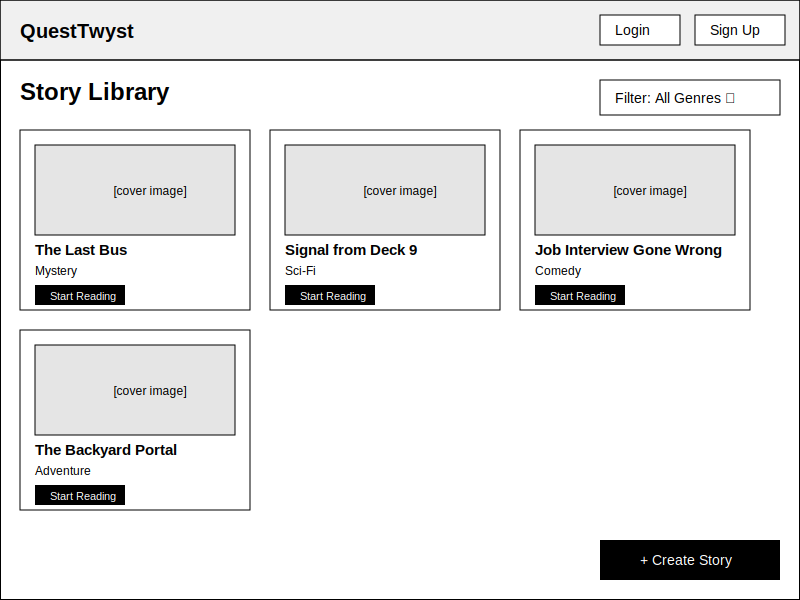
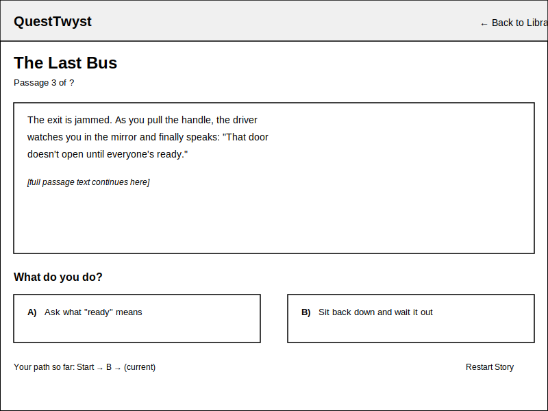
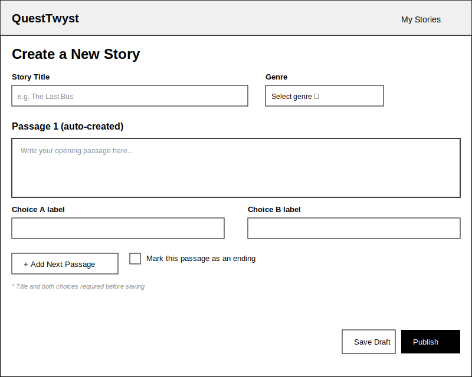

# Wireframes

Reference the Creating an Entity Relationship Diagram final project guide in the course portal for more information about how to complete this deliverable.

## List of Pages

- Story Library (browse/filter stories) ⭐
- Story Reader (read passages, make A/B choices) ⭐
- Story Creator / Editor (write passages and choices) ⭐
- Login / Sign Up
- User Profile / My Stories
- Story Path Recap (view choices made after finishing a story)

## Wireframe 1: Story Library

The library page displays all available stories as cards, each showing a cover image, title, and genre. Readers can filter by genre using the dropdown in the top right, and click "Start Reading" on any card to open the Story Reader page. A "Create Story" button in the corner lets logged-in users navigate to the Story Creator page.

## Wireframe 2: Story Reader

The reader page shows one passage at a time along with two choice buttons (A and B) below it. Selecting a choice loads the next passage without navigating to a new URL. A small path tracker at the bottom shows the choices made so far, and a "Restart Story" link lets the reader start over from the beginning.

## Wireframe 3: Story Creator / Editor

The creator page lets users enter a story title and genre, then write out passages and their two branching choices one at a time. A checkbox marks a passage as an ending, and validation prevents saving a passage until the title and both choices are filled in. Users can save as a draft or publish the story so it appears in the library.
